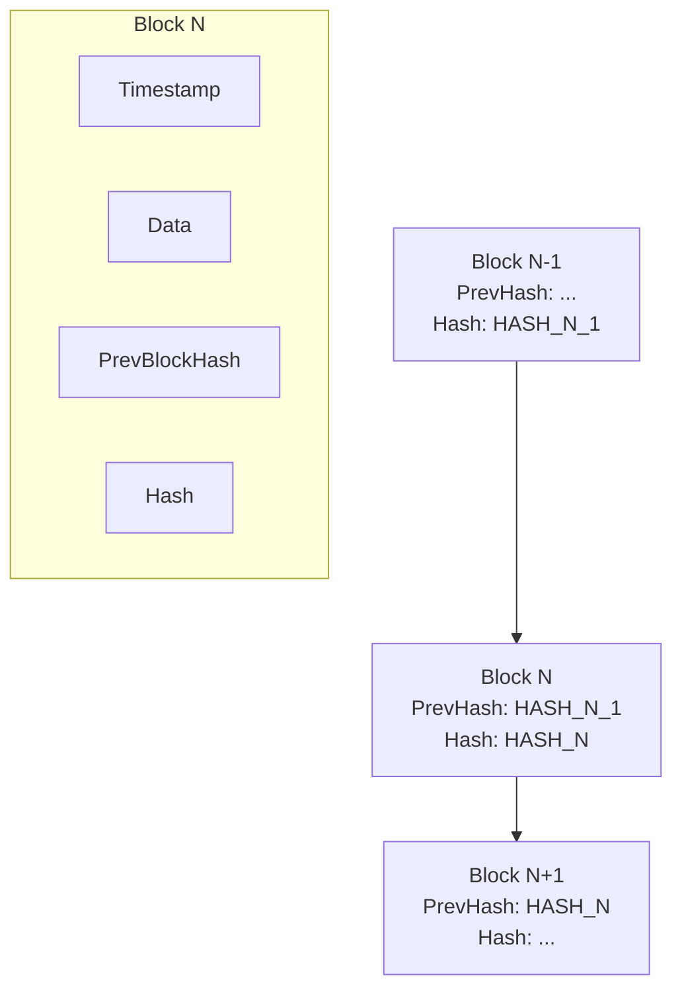
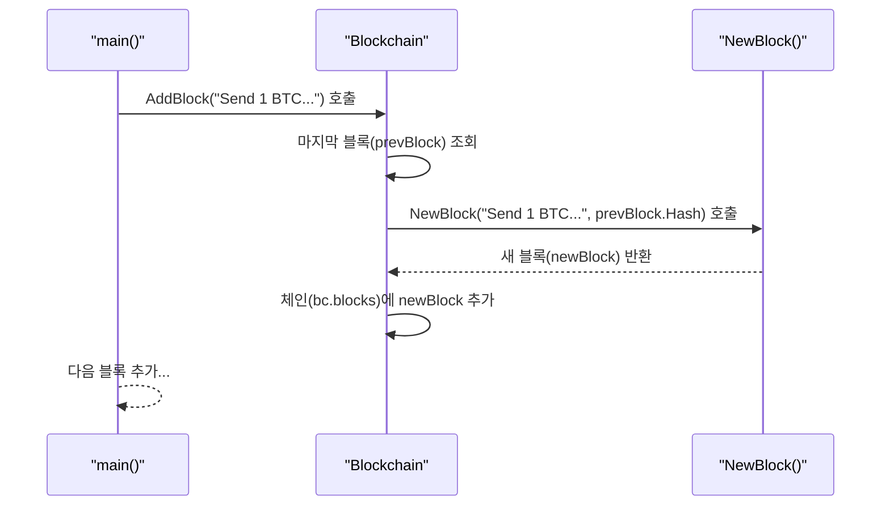
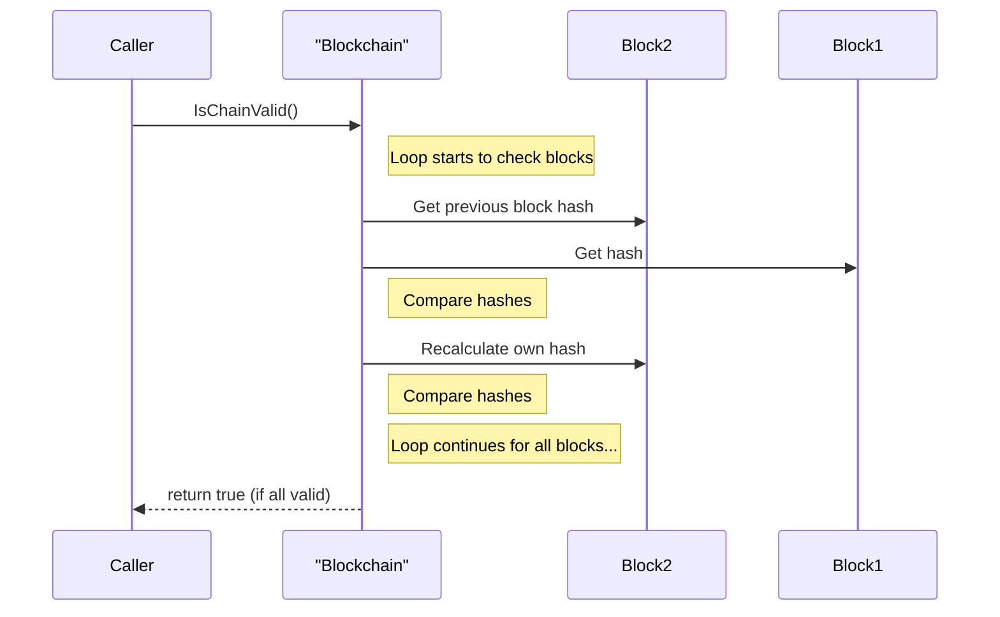

# Go 언어로 만드는 간단한 블록체인

블록체인은 분산 원장 기술(Distributed Ledger Technology)의 한 종류로, 데이터를 '블록' 단위로 저장하고 이를 '체인' 형태로 연결하여 무결성을 보장하는 기술임. 각 블록은 이전 블록의 정보를 해시(Hash) 값으로 포함하고 있어, 한 번 기록된 데이터는 위변조가 거의 불가능함. Go 언어는 내장된 해시 라이브러리와 명확한 구조체 정의를 통해 블록체인의 핵심 개념을 구현하기에 매우 적합함.

## Java와 Go로 구현하는 블록체인

Java는 하이퍼레저 패브릭(Hyperledger Fabric)이나 코다(Corda) 같은 엔터프라이즈 블록체인 플랫폼에서 널리 사용됨. 두 언어 모두 객체(구조체) 지향적인 방식으로 블록을 모델링하고, 표준 라이브러리를 통해 해시 알고리즘(예: SHA-256)을 사용할 수 있다는 점에서 공통점을 가짐.

| 개념 | Go | Java | 설명 |
|---|---|---|---|
| **블록 표현** | `struct` | `class` | 타임스탬프, 데이터, 이전 해시, 현재 해시 등을 필드로 가지는 데이터 구조. |
| **해시 계산** | `crypto/sha256` | `java.security.MessageDigest` | 블록의 데이터를 기반으로 고유한 해시 값을 생성하는 기능. |
| **체인 관리** | `[]*Block` (슬라이스) | `List<Block>` (리스트) | 생성된 블록들을 순서대로 저장하고 관리하는 컬렉션. |

이번 시간에는 거래 데이터를 저장하는 간단한 블록체인을 직접 만들면서 그 구조와 원리를 학습하겠음. 제네시스 블록(Genesis Block) 생성부터 새로운 블록 추가, 체인의 유효성 검증까지 단계별로 구현할 것임.

---

## 1단계: 블록 및 블록체인 구조 정의

가장 먼저 블록체인의 기본 단위인 `Block`과, 이 블록들을 담을 `Blockchain`의 구조를 정의해야 함.

- **Block**: 타임스탬프, 저장할 데이터, 이전 블록의 해시, 현재 블록의 해시로 구성됨.
- **Blockchain**: `Block` 포인터의 슬라이스(`[]*Block`)로, 생성된 블록들을 순서대로 저장함.

### 실습 1: 블록과 체인의 기본 구조 만들기

`Block`과 `Blockchain` 구조체를 정의하고, 체인의 첫 번째 블록인 제네시스 블록을 생성하는 코드를 작성함.

| API | 파라미터 | 리턴값 | 설명 |
|---|---|---|---|
| `time.Now().Unix()` | 없음 | `int64` | 현재 시간을 유닉스 타임스탬프(초 단위)로 반환함. |
| `strconv.FormatInt(i int64, base int)` | `int64`, `int` | `string` | 64비트 정수를 주어진 진법(base)의 문자열로 변환함. |
| `sha256.Sum256(data []byte)` | `[]byte` | `[32]byte` | 입력 데이터의 SHA-256 해시 값을 계산하여 32바이트 배열로 반환함. |
| `hex.EncodeToString(src []byte)` | `[]byte` | `string` | 바이트 슬라이스를 16진수 문자열로 인코딩하여 반환함. |

**실행 흐름 (블록 구조)**



**실습 파일: `15-간단-블록체인/main.go (step1)`**

```go
package main

import (
	"crypto/sha256"
	"encoding/hex"
	"fmt"
	"strconv"
	"time"
)

// 1. Block은 블록체인의 각 요소를 나타냄
type Block struct {
	Timestamp     int64
	Data          string
	PrevBlockHash []byte
	Hash          []byte
}

// 2. SetHash는 블록의 데이터를 기반으로 해시를 계산하고 설정함
func (b *Block) SetHash() {
	timestamp := []byte(strconv.FormatInt(b.Timestamp, 10))
	headers := append(b.PrevBlockHash, append([]byte(b.Data), timestamp...)...)
	hash := sha256.Sum256(headers)
	b.Hash = hash[:]
}

// 3. NewBlock은 주어진 데이터와 이전 블록 해시로 새 블록을 생성함
func NewBlock(data string, prevBlockHash []byte) *Block {
	block := &Block{time.Now().Unix(), data, prevBlockHash, []byte{}}
	block.SetHash()
	return block
}

// 4. Blockchain은 블록들의 체인을 나타냄
type Blockchain struct {
	blocks []*Block
}

// 5. NewBlockchain은 제네시스 블록과 함께 새 블록체인을 생성함
func NewBlockchain() *Blockchain {
	genesisBlock := NewBlock("Genesis Block", []byte{})
	return &Blockchain{[]*Block{genesisBlock}}
}

func main() {
	fmt.Println("============= step1 =============")
	bc := NewBlockchain()
	genesis := bc.blocks[0]
	fmt.Printf("Genesis Block Data: %s\n", genesis.Data)
	fmt.Printf("Genesis Block Hash: %s\n", hex.EncodeToString(genesis.Hash))
}
```

**코드 해설**

1.  `Block` 구조체: 블록을 구성하는 필수 요소들을 필드로 정의함. `Data`는 거래 내역 등 실제 정보를 담고, `PrevBlockHash`와 `Hash`가 체인을 연결하는 핵심 요소임.
2.  `SetHash` 메서드: 블록의 무결성을 보장할 해시를 계산함. 블록의 내용(타임스탬프, 데이터, 이전 블록 해시)을 모두 합친 뒤 SHA-256 알고리즘으로 해시 값을 생성함.
3.  `NewBlock` 함수: 새 블록을 쉽게 생성하기 위한 팩토리 함수. 현재 시간으로 타임스탬프를 설정하고, `SetHash`를 호출하여 자신의 해시를 계산함.
4.  `Blockchain` 구조체: `Block` 포인터의 슬라이스를 통해 체인을 표현함. 실제로는 데이터베이스에 연결되겠지만, 여기서는 메모리 내 슬라이스로 단순화함.
5.  `NewBlockchain` 함수: 체인의 첫 번째 블록, 즉 **제네시스 블록(Genesis Block)**을 포함한 새로운 블록체인을 생성함. 제네시스 블록은 이전 해시가 없으므로 비어있는 바이트 슬라이스를 사용함.

---

## 2단계: 체인에 블록 추가하기

블록체인이 생성되었으니, 이제 새로운 데이터를 담은 블록을 체인에 추가하는 기능을 구현해야 함. `AddBlock` 메서드는 마지막 블록의 해시를 가져와 새 블록의 `PrevBlockHash`로 설정하고, 새 블록을 체인에 추가함.

### 실습 2: 블록체인에 새 블록 추가

| API | 파라미터 | 리턴값 | 설명 |
|---|---|---|---|
| `append(slice, elems...)` | `slice []Type`, `elems ...Type` | `[]Type` | 슬라이스의 끝에 하나 이상의 요소를 추가하고, 결과 슬라이스를 반환함. |

**실행 흐름**



**실습 파일: `15-간단-블록체인/02-블록-추가/main.go`**

이전 실습 파일에 이어서 진행함

```go
// 6. AddBlock은 블록체인에 새 블록을 추가함
func (bc *Blockchain) AddBlock(data string) {
	// 2. 체인의 마지막 블록을 가져옴
	prevBlock := bc.blocks[len(bc.blocks)-1]
	// 3. 이전 블록의 해시를 사용하여 새 블록 생성
	newBlock := NewBlock(data, prevBlock.Hash)
	// 4. 새 블록을 체인에 추가
	bc.blocks = append(bc.blocks, newBlock)
}


func main() {
	fmt.Println("============= step1 =============")
	bc := NewBlockchain()
	genesis := bc.blocks[0]
	fmt.Printf("Genesis Block Data: %s\n", genesis.Data)
	fmt.Printf("Genesis Block Hash: %s\n", hex.EncodeToString(genesis.Hash))

	fmt.Println("\n\n============= step2 =============")
	bc.AddBlock("Send 1 BTC to Ivan")
	bc.AddBlock("Send 2 more BTC to Ivan")

	for _, block := range bc.blocks {
		fmt.Printf("Prev. hash: %s\n", hex.EncodeToString(block.PrevBlockHash))
		fmt.Printf("Data: %s\n", block.Data)
		fmt.Printf("Hash: %s\n", hex.EncodeToString(block.Hash))
		fmt.Println("----------------------------------")
	}
}
```

**코드 해설**

1.  `AddBlock` 메서드: `Blockchain` 타입에 대한 메서드로, 새 데이터를 받아 블록을 추가하는 역할을 함.
2.  `prevBlock := bc.blocks[len(bc.blocks)-1]`: 체인에 연결하기 위해 현재 체인의 마지막 블록을 가져옴.
3.  `NewBlock(data, prevBlock.Hash)`: 새 블록을 생성할 때, 이전 블록의 해시(`prevBlock.Hash`)를 `PrevBlockHash`로 전달하여 체인을 연결함.
4.  `bc.blocks = append(bc.blocks, newBlock)`: 생성된 새 블록을 블록체인의 슬라이스에 추가함.

---

## 3단계: 블록체인 유효성 검증

블록체인의 핵심은 무결성임. 즉, 체인에 저장된 데이터가 변경되지 않았음을 보장해야 함. 이를 위해 체인이 유효한지 검증하는 기능을 추가할 수 있음. 검증 로직은 간단함.

1.  현재 블록의 `PrevBlockHash`가 이전 블록의 `Hash`와 일치하는지 확인.
2.  현재 블록의 데이터를 기반으로 해시를 다시 계산하여 저장된 `Hash`와 일치하는지 확인.

이 두 조건 중 하나라도 실패하면 체인이 변조되었음을 의미함.

### 실습 3: 체인 무결성 검증 (보너스)

실제 블록체인 시스템에서는 더 복잡한 검증(예: 작업증명)이 필요하지만, 여기서는 데이터의 무결성만 간단히 확인하는 예제임.

| API | 파라미터 | 리턴값 | 설명 |
|---|---|---|---|
| `string(slice []byte)` | `[]byte` | `string` | 바이트 슬라이스를 UTF-8 문자열로 변환함. 해시 값 비교에 사용됨. |
| `append(slice[:i], slice[i+1:]...)` | `slice []Type` | `[]Type` | 슬라이스에서 i번째 요소를 제거하는 관용적인 표현. |

**실행 흐름**



**실습 파일: `15-간단-블록체인/main.go (step3)`**

이전 실습 파일에 이어서 진행함

```go
// 7. IsChainValid는 블록체인의 무결성을 검증함
func (bc *Blockchain) IsChainValid() bool {
	// 1. 제네시스 블록을 제외한 모든 블록을 순회
	for i := 1; i < len(bc.blocks); i++ {
		currentBlock := bc.blocks[i]
		prevBlock := bc.blocks[i-1]

		// 2. 현재 블록의 데이터로 해시를 다시 계산하여 저장된 해시와 일치하는지 확인
		tempHash := currentBlock.Hash
		currentBlock.SetHash() // 해시 다시 계산
		if string(currentBlock.Hash) != string(tempHash) {
			return false // 데이터가 변조됨
		}
		currentBlock.Hash = tempHash // 원래 해시로 복원

		// 3. 이전 블록의 해시와 현재 블록의 PrevBlockHash가 일치하는지 확인
		if string(currentBlock.PrevBlockHash) != string(prevBlock.Hash) {
			return false // 체인 연결이 끊어짐
		}
	}
	return true
}

func main() {
	fmt.Println("============= step1 =============")
	bc := NewBlockchain()
	genesis := bc.blocks[0]
	fmt.Printf("Genesis Block Data: %s\n", genesis.Data)
	fmt.Printf("Genesis Block Hash: %s\n", hex.EncodeToString(genesis.Hash))

	fmt.Println("\n\n============= step2 =============")
	bc.AddBlock("Send 1 BTC to Ivan")
	bc.AddBlock("Send 2 more BTC to Ivan")

	for _, block := range bc.blocks {
		fmt.Printf("Prev. hash: %s\n", hex.EncodeToString(block.PrevBlockHash))
		fmt.Printf("Data: %s\n", block.Data)
		fmt.Printf("Hash: %s\n", hex.EncodeToString(block.Hash))
		fmt.Println("----------------------------------")
	}

	fmt.Println("\n\n============= step3 =============")
	if bc.IsChainValid() {
		fmt.Println("✅ 블록체인 무결성 검증 성공!")
	} else {
		fmt.Println("❌ 블록체인 무결성 검증 실패!")
	}
}
```

**코드 해설**

1.  `for i := 1; ...`: 제네시스 블록은 검증할 이전 블록이 없으므로, 두 번째 블록(인덱스 1)부터 순회함.
2.  **데이터 무결성 검증**: 현재 블록의 내용을 기반으로 해시를 다시 계산(`currentBlock.SetHash()`)해보고, 블록에 이미 저장되어 있던 해시 값과 일치하는지 확인함. 만약 다르다면 블록의 `Data`가 누군가에 의해 변경되었음을 의미함.
3.  **체인 연결 검증**: 현재 블록에 저장된 이전 블록의 해시(`currentBlock.PrevBlockHash`)가, 실제로 이전 블록에 저장된 해시(`prevBlock.Hash`)와 같은지 확인함. 만약 다르다면 체인의 연결이 깨졌음을 의미함.

이 간단한 블록체인 구현을 통해 데이터가 어떻게 안전하게 연결되고 보호되는지에 대한 핵심 원리를 이해할 수 있음. 실제 암호화폐는 여기에 작업증명(Proof-of-Work), P2P 네트워크, 지갑, 암호학적 서명 등 훨씬 더 복잡한 기술들이 결합된 시스템임.
